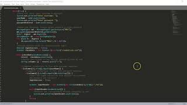

## **Informal Code Review:**

## **Artifacts:**

#### Software Design and Engineering
The artifact I chose to modify for software design and engineering is my final for the course IT 145. In this assignment it makes users login using their username and password, with a maximum login in tries of 3. For this assignment I decided to pick it for both software engineering and data structures. The reason I chose this artifact was because I thought it was a pretty universal code. The program is something I think I might be able to use and modify for different projects in the future. In order to enhance this artifact in the software engineering part I decided to transfer this project into the Python language. This shows that I'm well diversed in different coding languages enough to translate between the two and have them both function. After enhancing this artifact I learned how difficult it actually is to convert one coding language into another one. I had trouble figuring out was code was equivalent to the other. I couldn't figure out how to convert the hashing, so I just had to remove that section completely. Besides that, the code that is now in Python is very similar, if not the same code that I started off with in Java.

#### Algorithms and Data Structures
The artifact attached is for the algorithm and data structure part of the portfolio. I made this file in one of my beginner courses in the program. It was my final for IT145. The reason I chose this project was because I think it fit the criteria very well for data structure and using algorithms in the code. Also, I wanted to use a project that I worked on earlier to see the progress I’ve made so far in this program. By using the knowledge I have now, I hope I will be able to enhance the code greatly. I think this code showcases algorithm and data structures because it requires a lot of organizing in how the code should be structured. What loop should go where, and for what. What should the loop do, when should it close. There’s a lot of moving parts in this code. So far, the artifact has been improved by letting the user punch in and out after they’ve logged in. I did meet the enhancements that I said I was going to make. But would also like to improve it further. I would like to be able to storage the punches in and out, as well as modify the code slightly so there are no holes. Modifying this artifact was a little difficult just because I didn’t work in java in a long time that I had to dust of some cobwebs. I also had to remember what functions did what. I ran into a challenge where I wanted the user to be able to return back to the menu after they punched in and out, but it kept restarting the program. I did some research and figured it out. By doing that I understand the switch and case function much better. 

#### Database
For my last artifact for databases I chose to use my final for the course DAD 220. For the enhancement on this artifact I wanted to make the code more complex and to be able to retrieve more data within different tables, make it more interactive.

[()](Final Project DAD220.pdf)

#### Professional Self-Assessment
This course definitely showed me where my strengths are in coding, as well as helped me focus where I want to go in the computer science industry. Out of all three artifacts I think I excelled in data structures. Looking at the code, it just made sense on how it should look and what things should go first in the code. Although I did have some trouble because I never worked with the Date() function, I understood what the requirements I needed to meet and had an idea of how to get there. Where as when I was working with the other two artifacts I was a little confused, and needed to constantly take a break to make sense of what I was doing. This course also taught me that working in the computer science industry requires a team environment. That's important to have because by working in a team, you have other people to help you if you get stuck, as well as look over your work for potential errors that you missed that could lead to vulnerabilities within the code. It's hard to catch some security errors, because they work funcitonality, but by working together and having more than your set of eyes reviewing the code, it will help make the code run more efficiently and safely. 

For my artifacts, I think they fit together as a whole because it shows my diversity as a developer. You start off with the most broad topic, software engineering and design. By converting the code from Java to Python, it shows I have the knowledge in both languages to convert programs as needed. Next, you get in a little more depth with algorithms and data structure. This shows that I understand how and why parts of the codes work, and am able to organize the code in such a way that it flows smoothly. This also shows that I can look at a code and see where it can be modified or improved. Finally, we move on to databases, which is an even more in depth concept. This artifact completes the portfolio by showing I am knowledgable in all areas of computer science. Knowing databases and how they function shows I am able to write in more than just Java or Python, but in mySQL as well. Which is a completely different way of coding.
